# 📚 School Library Management System

A modern, high-performance web application for managing school library operations, book catalogues, members, borrowing workflows, and analytical reporting. Built with **ASP.NET Core 10 Razor Pages**, **Entity Framework Core 10**, **Microsoft SQL Server**, and styled with **Tailwind CSS v4**.

Features a responsive design with **full Light and Dark Mode support**, instant search and filtering, and an **expandable / collapsible sidebar** optimized for full-screen desktop and mobile experiences.

---

## 📸 Interface Previews

### 1. Dashboard Overview

#### Light Mode
| Expanded Sidebar | Collapsed Sidebar |
| :---: | :---: |
| 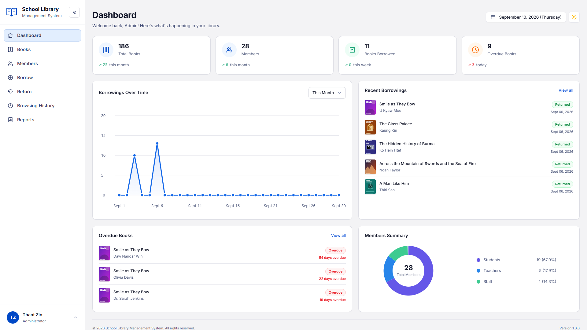 | 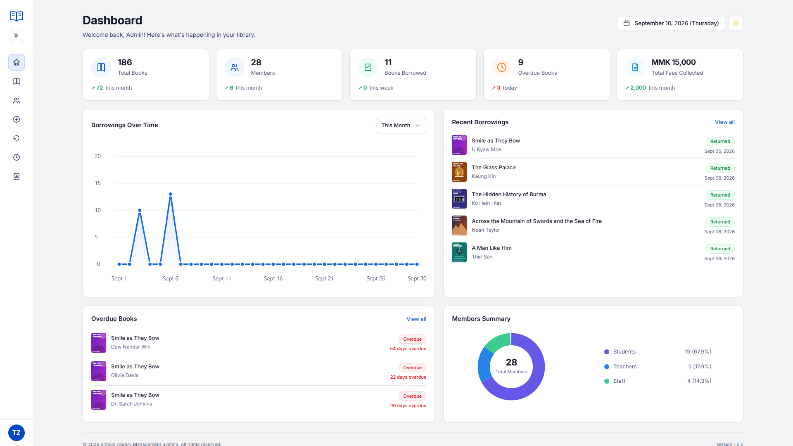 |

#### Dark Mode
| Expanded Sidebar | Collapsed Sidebar |
| :---: | :---: |
| 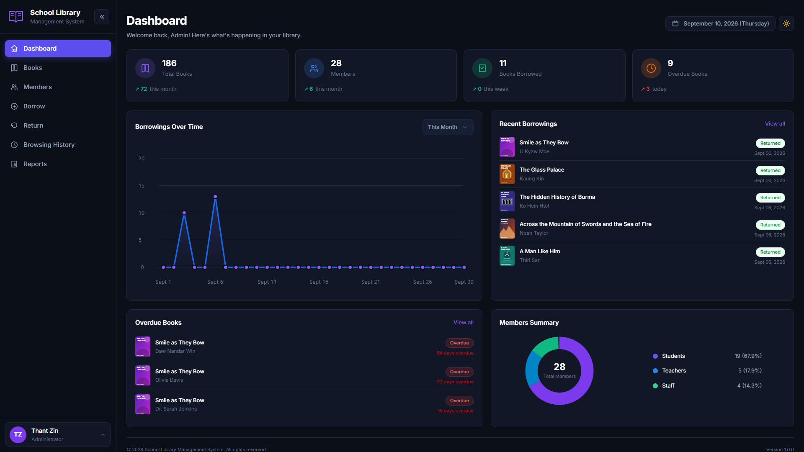 | 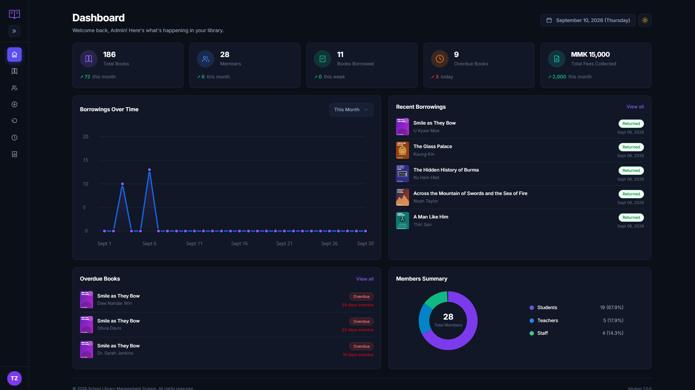 |

---

### 2. Books Catalogue & Unified Filters

Featuring instant search by Title, Author, ISBN, or Category, accompanied by real-time status and genre dropdown filters.

#### Light Mode
| Expanded Sidebar | Collapsed Sidebar |
| :---: | :---: |
| 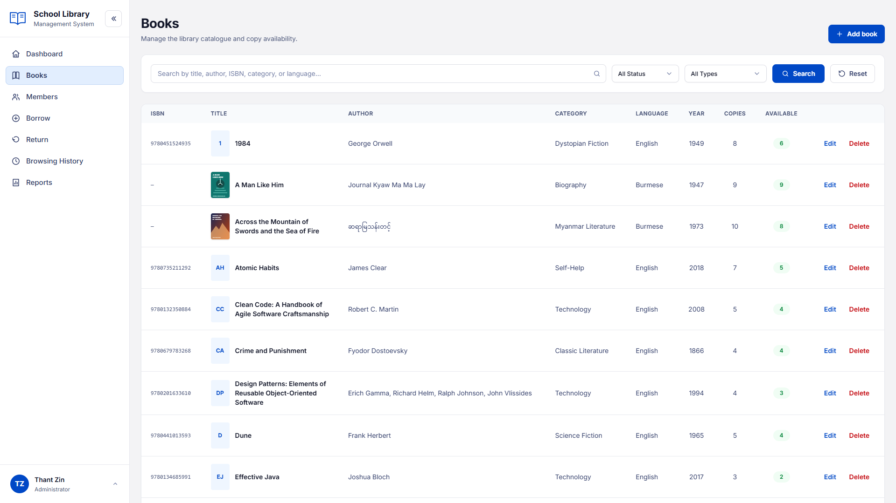 | 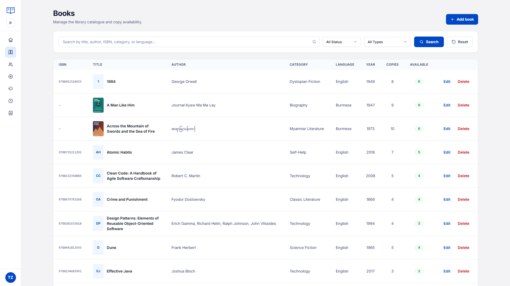 |

#### Dark Mode
| Expanded Sidebar | Collapsed Sidebar |
| :---: | :---: |
| 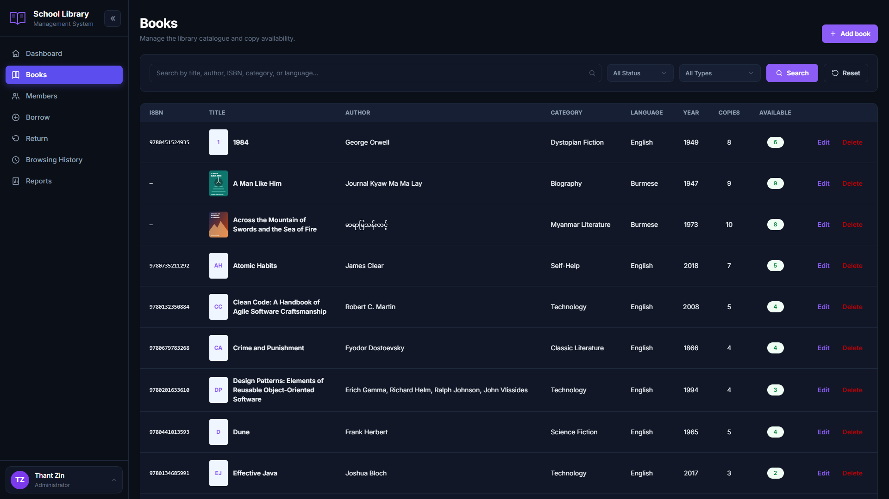 | 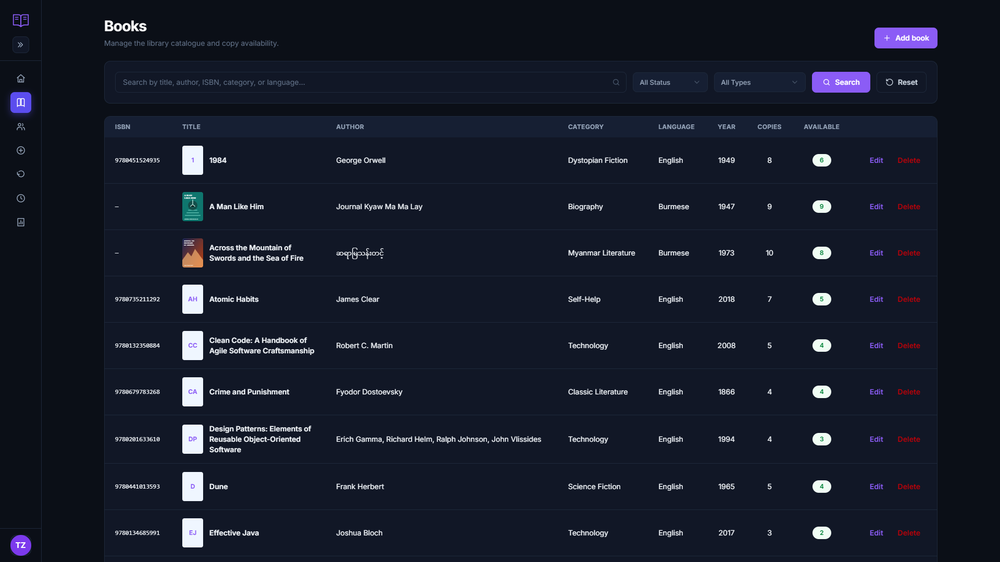 |

---

### 3. Members & Administration

| Members Directory (Light Mode) | Members Directory (Dark Mode) |
| :---: | :---: |
| 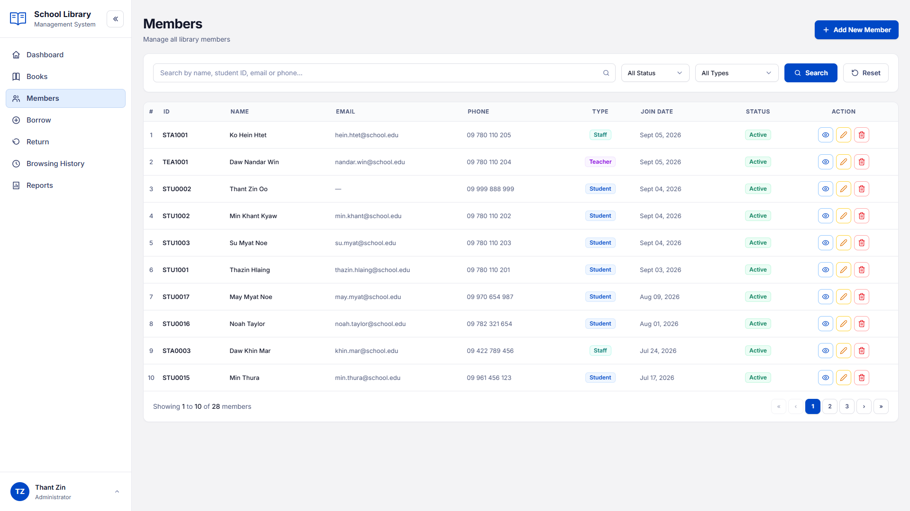 | 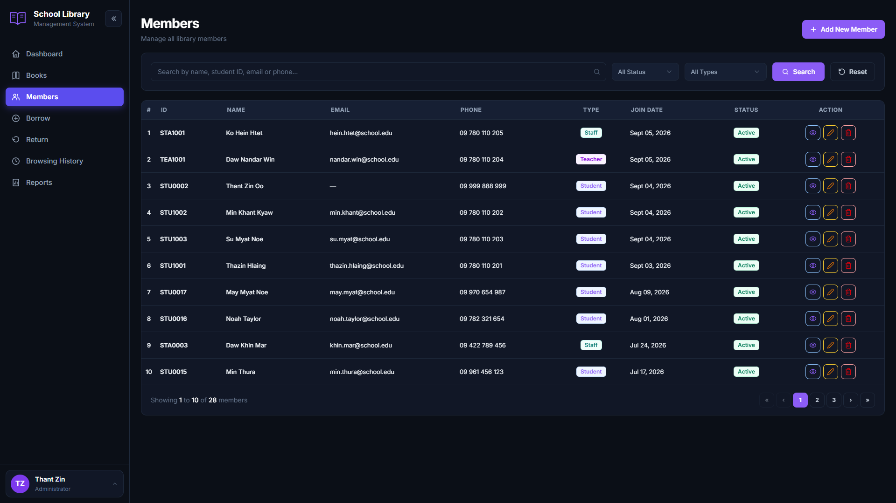 |

| Borrowing Management | Admin Login |
| :---: | :---: |
| 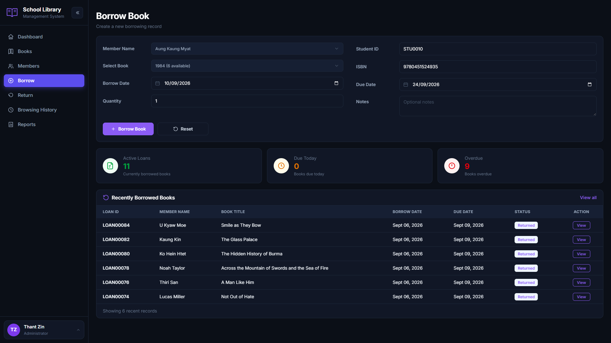 | 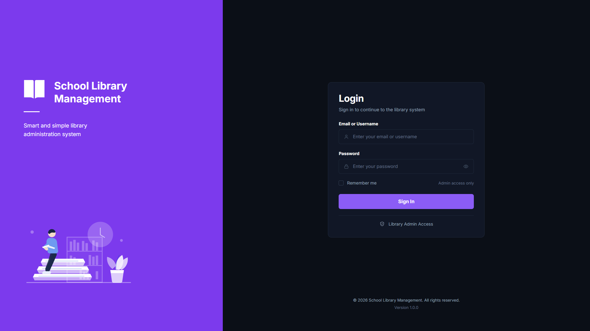 |

---

## ✨ Features

### 📊 Real-Time Analytical Dashboard
- **KPI Metrics**: Real-time tracking of Total Books, Active Members, Currently Borrowed Books, Overdue Items, and Fine Revenue.
- **Dynamic Trend Chart**: Interactive monthly and period-based borrowing trends rendered via responsive vector charts.
- **Live Feeds**: Fast-access widgets for recent borrowings, overdue returns with calculated day counts, and member distribution breakdowns.

### 📖 Book Catalogue Management
- **Catalog Operations**: Full CRUD lifecycle for books with ISBN uniqueness validation, copy inventory, and shelf availability tracking.
- **Smart Search & Filters**: Unified toolbar enabling real-time search across titles, authors, categories, and languages, paired with status and type dropdown filters.
- **Cover Image Storage**: High-resolution cover uploads with automatic SVG cover generation for seeded literature titles.

### 👥 Member Administration
- **Multi-Tier Memberships**: Support for **Student**, **Teacher**, and **Staff** member classifications.
- **Department & Contact Tracking**: Manage student IDs, departments, phone numbers, and academic emails.
- **Activity & Status**: One-click member activation/deactivation and detailed member history modals.

### 🔄 Borrow & Return Workflows
- **Circulation Control**: Transaction-safe checkout and return workflows with real-time stock deduction and restoration.
- **Fine Calculation Engine**: Automatic fine calculation for overdue items based on due dates.
- **Condition Grading**: Inspection notes and book condition status tracking (*Good*, *Late*, *Damaged*).

### 📈 Reports & Library Settings
- **Periodic Reports**: Filter library activity by current month, previous month, current year, or custom date ranges.
- **Customizable Preferences**: System-wide defaults for reporting periods, theme preferences, and export formats.

### 🌓 Smooth Dark Mode & Collapsible Navigation
- **Ultra-Smooth Theme Switching**: Instant toggling between Light and Dark themes with zero-flash layout hydration (`_ThemeBootstrap.cshtml`).
- **Sidebar Ergonomics**: Dual-state sidebar supporting full expanded mode (with labels and active indicators) and compact collapsed mode (icon-only navigation with tooltips), complete with localStorage persistence.
- **Mobile Off-Canvas**: Responsive drawer with dimmed backdrop support for tablets and mobile devices.

### 🔒 Security & Admin Controls
- **Cookie Authentication**: Strict cookie-based session security with `HttpOnly`, `SameSite=Lax`, and 8-hour sliding expiration.
- **Lockout Protection**: Automatic account lockout after 5 consecutive failed attempts with a 15-minute cooldown.
- **First-Time Password Change**: Mandatory initial password rotation flow with complexity validation (uppercase, lowercase, number, symbol, min 10 chars).
- **Accessible Confirmation Modals**: Keyboard-trapped (Esc, Tab) accessible modals preventing accidental deletion of records.

---

## 🛠️ Technology Stack

| Layer | Technology |
| :--- | :--- |
| **Framework** | [ASP.NET Core 10 Razor Pages](https://learn.microsoft.com/aspnet/core/razor-pages/) |
| **Runtime & Language** | .NET 10.0 / C# 13 |
| **Database** | Microsoft SQL Server (LocalDB / Express / Enterprise) |
| **ORM & Migrations** | [Entity Framework Core 10](https://learn.microsoft.com/ef/core/) |
| **Styling & Design** | [Tailwind CSS v4](https://tailwindcss.com/) (Standalone CLI pipeline) |
| **Scripting & DOM** | Vanilla JavaScript (ES6+, zero heavy JS framework dependencies) |
| **Charts** | HTML5 Canvas / Responsive SVG Data Visualizations |
| **Security** | ASP.NET Core Cookie Authentication & Identity PBKDF2 Password Hasher |

---

## 🚀 Getting Started

### Prerequisites
- [.NET 10 SDK](https://dotnet.microsoft.com/download/dotnet/10.0)
- [Node.js](https://nodejs.org/) (v18.0.0 or higher)
- [Microsoft SQL Server](https://www.microsoft.com/sql-server) or **SQL Server Express** running locally.

---

### Installation & Setup

1. **Clone the repository:**
   ```bash
   git clone https://github.com/thantzinoo-dev/school-library-management.git
   cd school-library-management
   ```

2. **Configure Connection String:**
   Ensure `appsettings.Development.json` matches your local SQL Server instance:
   ```json
   {
     "ConnectionStrings": {
       "DefaultConnection": "Server=localhost\\SQLEXPRESS;Database=SchoolLibraryDB;Trusted_Connection=True;TrustServerCertificate=True;"
     },
     "SeedAdmin": {
       "Username": "admin",
       "Email": "admin@schoollibrary.edu"
     }
   }
   ```

3. **Install Dependencies & Build Tailwind CSS:**
   ```bash
   npm install
   npm run css:build
   ```

4. **Apply Database Migrations:**
   ```bash
   dotnet ef database update
   ```
   *(The database initializer automatically seeds sample books, members, borrow records, and the default admin account on initial launch.)*

5. **Run the Application:**
   ```bash
   dotnet run
   ```

6. **Open in Browser:**
   Navigate to:
   ```text
   http://localhost:5141
   ```

---

### 🔑 Default Admin Credentials

When the database initializes, the following credentials are ready for use:

| Field | Value |
| :--- | :--- |
| **Username** | `admin` |
| **Email** | `admin@schoollibrary.edu` |
| **Password** | `Admin@123456` |

---

## 📁 Project Structure

```text
School Library Management/
├── Data/
│   ├── ApplicationDbContext.cs       # EF Core DB context with entity configurations & check constraints
│   └── DbInitializer.cs              # Database seeding with Myanmar & international literature
├── Migrations/                       # Entity Framework migration snapshots
├── Models/
│   ├── AdminAccount.cs               # Admin authentication credentials & lockout state
│   ├── AdminProfile.cs               # Admin personal profile & contact info
│   ├── Book.cs                       # Book model with ISBN, copy counts & cover image path
│   ├── BorrowRecord.cs               # Borrow transactions with date tracking & fine calculation
│   ├── LibrarySettings.cs            # Global preferences for themes & report defaults
│   └── Member.cs                     # Library member model with type & department
├── Pages/
│   ├── Books/                        # Book catalogue, create, edit, & details
│   ├── Borrow/                       # Book checkout workflow
│   ├── Members/                      # Member administration & details
│   ├── Profile/                      # Admin profile editor & password rotation
│   ├── Reports/                      # Activity reporting & export indicators
│   ├── Return/                       # Return processing & fine assessment
│   ├── Settings/                     # Application & theme preferences
│   ├── Shared/                       # Layouts, sidebar, theme bootstrap, & confirm dialogs
│   ├── Index.cshtml                  # Dashboard landing view
│   ├── Login.cshtml                  # Secure admin sign-in
│   └── Logout.cshtml                 # Session sign-out handler
├── Services/
│   ├── AdminAuthentication.cs        # Claims principal creation & normalization helpers
│   └── BookCoverStorage.cs           # Cover image validation & physical disk storage
├── Styles/
│   └── app.css                       # Tailwind CSS v4 input design system
├── wwwroot/
│   ├── css/app.css                   # Compiled, minified Tailwind CSS bundle
│   ├── images/books/                 # Fallback SVG book covers
│   ├── js/                           # Theme toggler, sidebar collapse, & confirm modal scripts
│   └── uploads/books/                # Uploaded cover images
├── docs/
│   └── screenshots/                  # High-resolution full-screen interface previews
├── package.json                      # Tailwind CSS v4 CLI build scripts
├── Program.cs                        # Web app bootstrap, middleware, cookie auth, & route security
└── README.md                         # Project documentation
```

---

## 📜 NPM Scripts

| Command | Description |
| :--- | :--- |
| `npm run css:build` | Compiles and minifies `./Styles/app.css` into `./wwwroot/css/app.css`. |
| `npm run css:dev` | Generates development CSS bundle without minification. |
| `npm run css:watch` | Starts Tailwind CLI in continuous watch mode for hot stylesheet rebuilding. |

---

## 📄 License

This project is licensed under the [MIT License](LICENSE).
